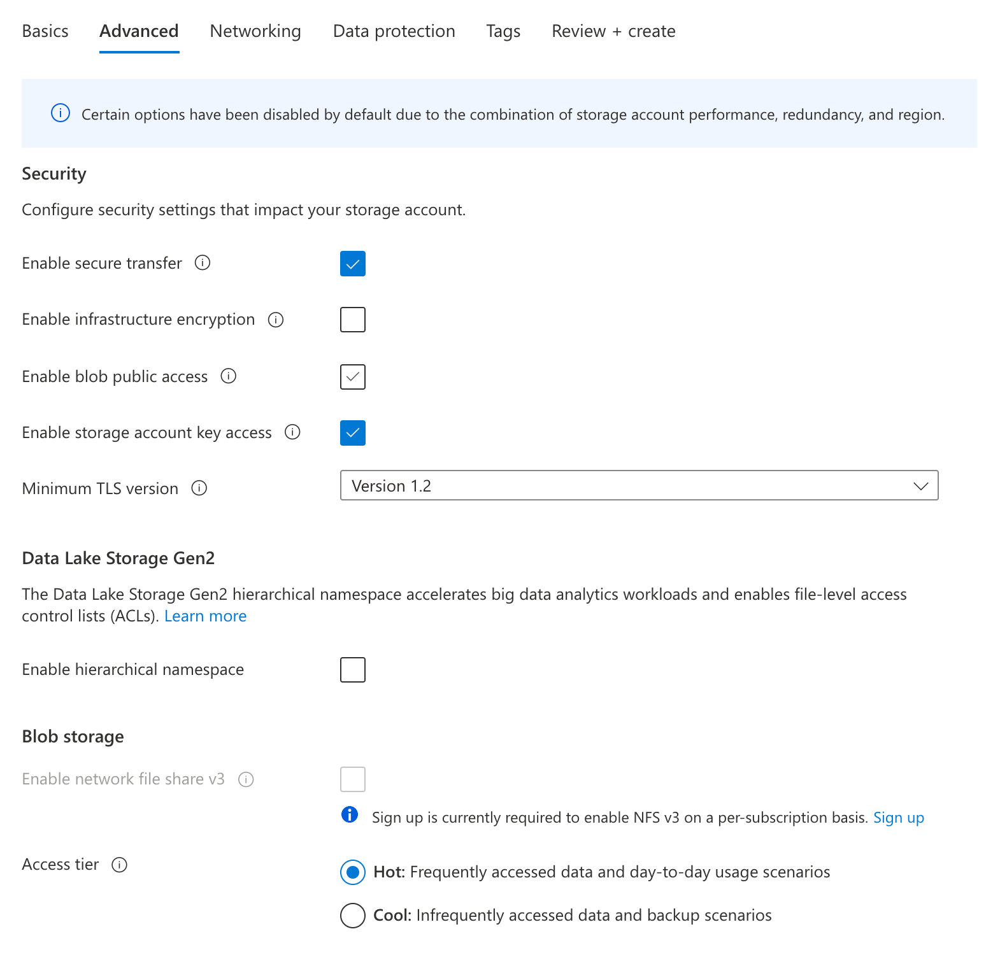
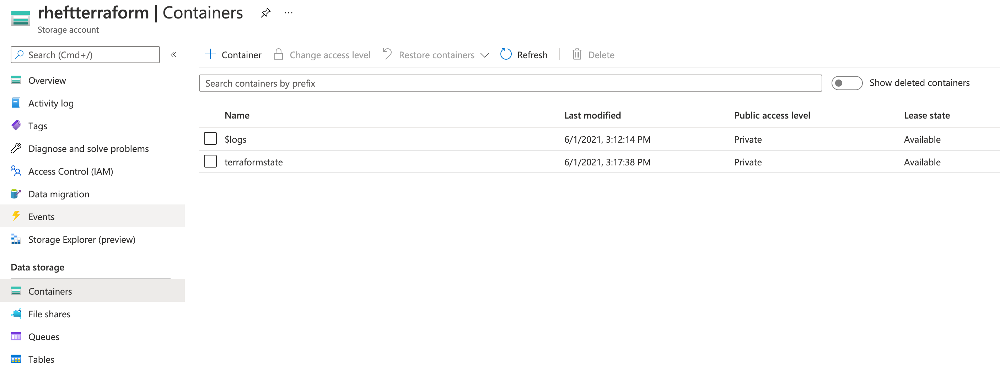

# PRIME ReportStream Operations

PRIME ReportStream uses Terraform to manage our Azure development environment. All Azure configuration should be done through Terraform to ensure consistency between environments.

To ensure our Terraform state is managed with consistent Terraform versions, we are running Terraform through a Docker image. Terraform should not be used outside of this Docker image to ensure the Terraform core, plugins, and other versions all remain identical.


## Connect to the VPN

All infrastructure operations must be done behind the environment-specific VPN. You can find [directions for configuring your VPN client in prime-router/docs/VPN.md](https://github.com/CDCgov/prime-data-hub/blob/master/prime-router/docs/vpn.md).


## Run Terraform interactively

Ensure you have the intended git branch checked out and navigate to the `./operations` directory in your CLI. For production deploys, always deploy from the `master` branch.

```
docker-compose run {dev,test,staging,prod}
```

Running the above command will drop you into an interactive bash terminal for the designated environment.


## Login to Azure CLI (on first run and after token expiration)

```
az login
```

- Navigate to the provided login URL and input the provided token

This only needs to be on first run and after your Azure credentials expire. The state of your login will be persisted in a Docker volume.


## Set the default Azure subscription (on first run only)

If you have access to multiple Azure subscriptions, ensure you set the intended subscription as the default, or you will see errors from Terraform:

```
az account list
az account set -s {subscription-id}
```


## Using Terraform

Initialize the Terraform environment (this needs to completed on first run and after every new module)

```
terraform init
```

Generate a plan (use the  `-out` flag to ensure the same plan gets applied in the following step)

```
terraform plan -out plan.out
```

Review the above plan, then apply it to the environment

```
terraform apply plan.out
```

### Caveats

The Azure Terraform module has several known quirks that result in unexpected additions to the Terraform plan:

* Postgres Server Key (`module.prime_data_hub.module.database.azurerm_postgresql_server_key.postgres_server_key[0]`)
  * Our Postgres encryption key is managed by the CDC
  * Whenever the CDC rotates the key, Terraform thinks a change needs to be applied
  * No change is actually applied when Terraform applies the plan, so there is no harm in accepting this change
* Front Door configuration (`module.prime_data_hub.module.front_door.azurerm_frontdoor.front_door`)
  * The API Terraform uses to return the Front Door configuration does not return the configuration in a stable order
  * This causes Terraform to *think* there are changes that need to be applied, when there are actually none
  * There is no harm in accepting Terraform's suggested changes, but Front Door can take 30+ minutes to deploy, so it advised to use resource targeting to avoid this issue (more on this in the next section)
* Function App configuration (`module.prime_data_hub.module.function_app.azurerm_function_app.function_app`)
  * The Function App is not run on a private endpoint, since the Front Door does not support private endpoints at this time
  * Due to this, we are manually whitelisting developer IPs in the firewall configuration
  * Terraform will suggest removing or adding IPs to the configuration
  * There is no harm in accepting Terraform's suggested changes, but developers will have to re-add their IP to the firewall the next time they access the Function App

#### Work Around for Caveats: Resource Targeting

To work around unexpected plan changes, we are leveraging resource targeting to apply only the section of the plan we care about. We typically apply by an entire module at a time. For example, to generate a plan for the Key Vault module:

```
terraform plan -out plan.out -target module.prime_data_hub.module.key_vault
```

#### Future Fixes to the Known Caveats

In addition to bug fixes that are being applied to the upstream Azure modules, we are planning to break out our Terraform state into modules that are run independently of each other, to avoid these quirks.


## Terraform development

Once you are authenticated with Azure CLI, you can access your locally stored terraform state through the bind mount.  If you are developing for the `test`, `staging`, or `prod` environments, the terraform state will be stored in the respective Azure storage account. Within `dev` you will be prompted to enter your developer name (eg. cglodosky) to deploy to the appropriate resource group.


## Changing the Dockerfile

After making any changes to the `Dockerfile` make sure you run:

```
docker-compose build
```


# Deploying a new environment

* Environments must have a unique resource group.
* Resources groups are managed by the CDC.
* Contact the IAM team at <adhelpdsk@cdc.gov> to get your resource group created.

## Create the Terraform storage account

1. Login to your Azure console.
2. In the intended resource group, create a storage account named: `{prefix}terraform`
    * Note: Storage account names do not allow punctuation
3. Follow the screenshots and replicate the settings





## Create the Terraform storage container

In your newly created storage account, create a container named: `terraformstate`



## Create your Terraform configuration

1. Pick an existing environment and duplicate the following folders with your new environment name:
    * `environments/{env}-network`
    * `environments/{env}-persistent`
    * `environments/{env}-app`
2. Update the `docker-compose.yml` file with your three new environment configurations
    * Ensure to replace the environment name when you copy your configuration
3. In each of the three folders, update the `main.tf` file with the environment variables that pertain to the environment
    * Ensure to update the `backend "azurerm"` block with your storage account created above

## Deploy the environment

Follow the above directions…

1. Deploy the `{env}-network` module
    * Deploy of the module for the first time will take over an hour
2. Deploy the `{env}-persistent` module
3. Deploy the `{env}-app` module


# Tear down a environment


## Deploying a new environment

The order matters for deploying an environment from scratch. While Terraform handles most of the work, the order of operations matter as items like the VPN must be stood up first.

We have not recently deployed an environment from scratch, so we could use assistance in building this documentation.

The rough steps will be:

### Deploy the network and VPN

Use resource targeting to deploy only the network module.

```
terraform plan -target module.prime_data_hub.module.network -out plan.out
terraform apply plan.out
```

### Build a VPN profile

[See PR #638 for directions on standing up a VPN.](https://github.com/CDCgov/prime-data-hub/pull/638)

### Deploy the environment several times

Azure requires multiple Terraform deploys to create the service identities needed for building access profiles. Due to this, the deploy will need to be run several times. The first time a service identity is created, the second time the access profile is created from the identity.

There will also need to be some resource targeting throughout the deployment. This is a section we will need help documenting.
